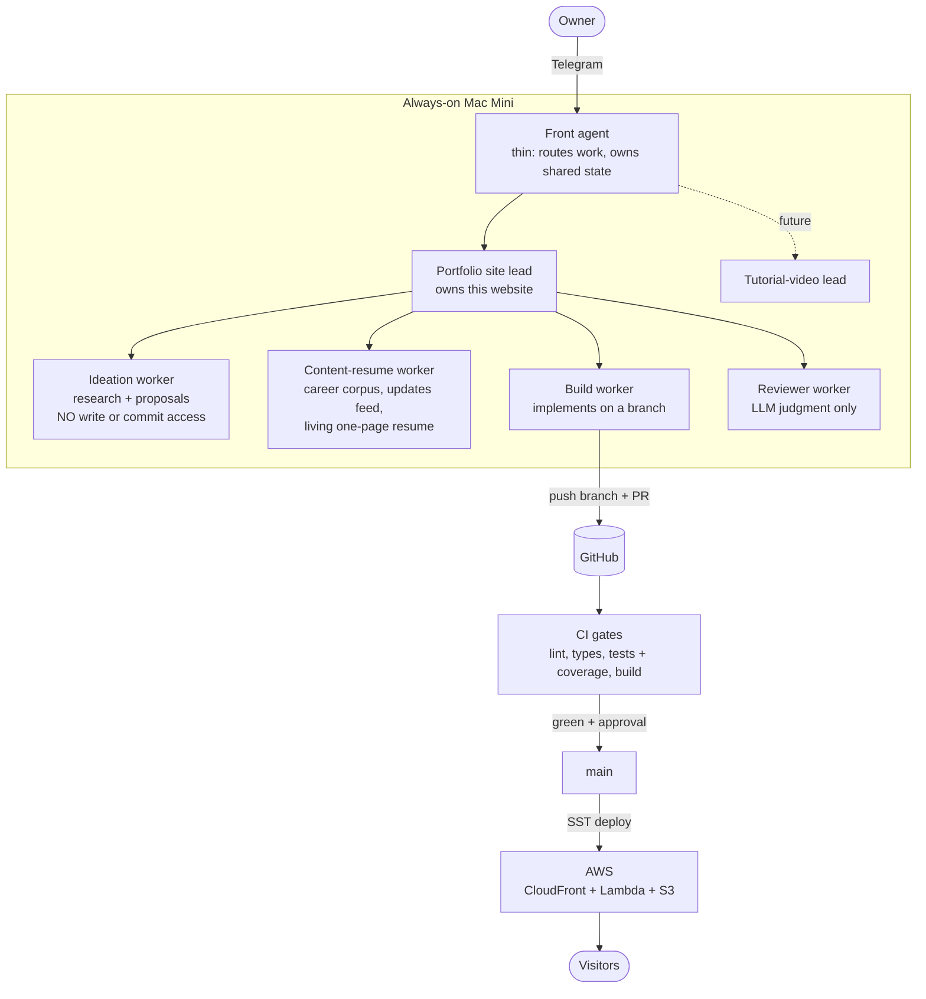

# auto-portfolio

A terminal-style portfolio site that is also a live demonstration of an autonomous,
agent-run development pipeline. The site does not just describe the system. The system
builds, tests, reviews, and ships the site.

Live site: coming soon (AWS via SST).

## The idea

A fleet of agents on an always-on Mac Mini maintains this site with minimal human input:

- Every day the pipeline picks one useful, low-risk improvement, builds it on a branch,
  runs deterministic checks, has it reviewed, and opens a PR. Trivial polish auto-merges.
  Anything user-visible waits for a one-tap approval on Telegram.
- Every afternoon a check-in interviews the owner over Telegram about what they worked on.
  If the gathered information synthesizes into something worth posting, it lands in the
  live `updates` feed. The one-page resume only regenerates when a contribution genuinely
  warrants it, so the feed grows freely while the resume stays disciplined.

## Architecture



Three levels, hard ceiling: front agent, project leads, workers. New projects bolt on as
new leads with no rework.

### Guardrails

- The ideation worker has zero write or commit access; its output is treated as untrusted.
- Deterministic checks (lint, types, tests, build) are scripts, never agent judgment.
  The reviewer adds judgment on top; it never replaces the scripts.
- Human merge is the final gate for anything user-visible.
- Every build-review loop has a hard iteration cap.
- Secrets live in local `.env` files (see `.env.example`), never in the repo.

## The site

A custom React terminal engine (no xterm.js) so rich blocks, animation, and mobile
behavior stay fully controllable:

- Click-or-type commands: `me`, `about`, `updates`, `skills`, `projects`, `resume`,
  `contact`, `help`, `clear`, plus aliases (`whoami`, `work`, `cv`, ...)
- Editor-style tabs you can open, switch, and close
- cmd-K command palette, arrow-key history, tab completion
- `updates` renders as a live animated tail log fed from `content/updates.json`,
  the file the agent pipeline appends to
- Animated skill bars + radar chart (Recharts), staggered reveals (Framer Motion)
- Fully responsive: windowed terminal on desktop, full-screen on mobile

## Stack

Next.js (App Router) / React / TypeScript / Tailwind CSS v4 / Framer Motion / Recharts /
Vitest + React Testing Library / SST on AWS / GitHub Actions

## Build and run

```bash
npm install
npm run dev            # http://localhost:3000
npm run test           # unit + component tests
npm run test:coverage  # tests with coverage thresholds (CI runs this)
npm run build          # production build
```

Deploy (needs AWS credentials in `.env`, see `.env.example`):

```bash
npx sst deploy --stage production
```

## Flow of a change

1. A branch is created (by an agent or a human)
2. Push opens a PR
3. CI runs eslint, tsc, the test suite with coverage thresholds, and the production build
4. Review happens (reviewer worker for judgment, human for anything user-visible)
5. Merge to `main`, deploy to AWS via SST

## Content seams

- `content/data.ts` - profile, about, skills, projects, resume
- `content/updates.json` - the live feed; the pipeline appends entries here
- Client engagement projects are generalized on purpose (industry, never the client name),
  and a privacy-guard test in CI enforces that no client names, phone numbers, or private
  emails ever ship
