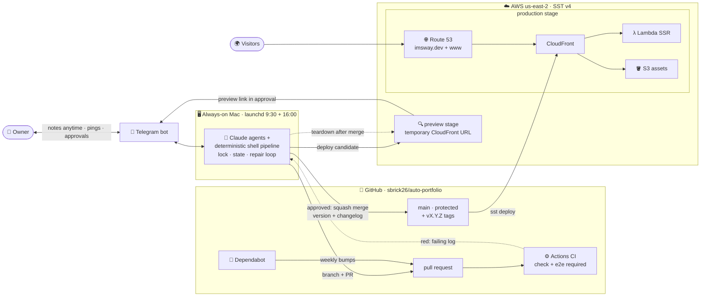
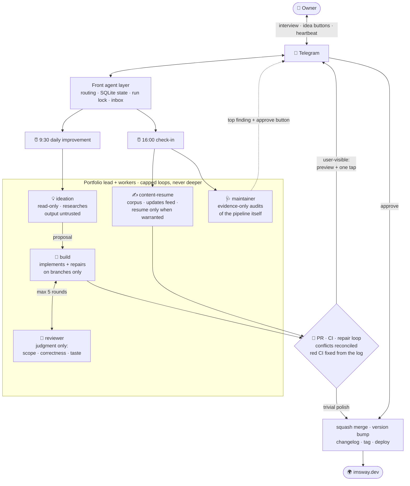

# auto-portfolio

A terminal-style portfolio site that is also a live demonstration of an autonomous,
agent-run development pipeline. The site does not just describe the system. The system
builds, tests, reviews, versions, and ships the site - on its own schedule, every day.

Live: **[imsway.dev](https://imsway.dev)** · try the `changelog` command (and find the secret one)

**Docs:** [the agent pipeline](docs/pipeline.md) ·
[architecture and deployment](docs/architecture.md) ·
[development](docs/development.md)

## Architecture and deployment

How a change travels: agents work on the Mac, GitHub gates it, AWS serves it, and the
owner approves from a phone.



## The agents

Who does what: three levels with a hard ceiling - front agent, project lead, workers.
Every user-visible change ends at the same gate: preview link + human approval.



## How it runs on its own

- **9:30** - ideation proposes one researched improvement, build implements it on a
  branch, the reviewer judges it, CI gates it, a preview stage goes up, and the owner
  ships it with one tap. Trivial polish auto-merges; the preview is torn down after
  every merge.
- **16:00** - the bot interviews the owner (notes texted anytime fold in from an
  inbox), the content worker feeds the private career corpus and the site's live
  `updates` feed, three ideas for tomorrow arrive as buttons, Dependabot PRs are
  processed, and the maintainer audits the pipeline itself.
- **Anything red** enters the repair loop: conflicts get merged and reconciled
  semantically, stale branches get updated, failing CI logs get handed to the build
  worker - capped rounds, never weakening tests. If Dependabot's own branch is beyond
  repair, the pipeline re-does the bump itself on a fresh branch.
- **While anything is in flight** the owner gets a heartbeat ping every minute with
  the current step; it pauses whenever the system is waiting on a human.

Full detail: [docs/pipeline.md](docs/pipeline.md).

## Guardrails

- Agents act only on instructions from the owner (or Dependabot bumps). External PRs,
  issues, and comments are untrusted input - reported, never obeyed.
- Deterministic checks are scripts and CI, never agent judgment. Human merge is the
  final gate for anything user-visible.
- Privacy guards run in CI: client names generalized to industries, no phone numbers,
  no private emails. Secrets live only in local `.env` files, never in the repo.
- Every loop is hard-capped. A maintainer fix that breaks anything pauses the pipeline.

## Quick start

```bash
npm install
npm run dev    # http://localhost:3000
npm run test   # unit + component suites
```

More in [docs/development.md](docs/development.md).
