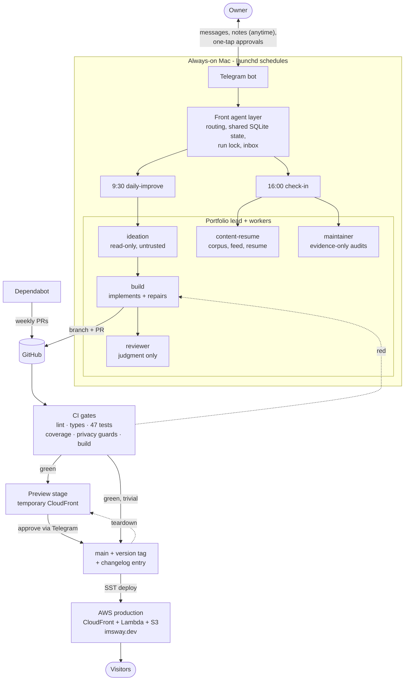

# auto-portfolio

A terminal-style portfolio site that is also a live demonstration of an autonomous,
agent-run development pipeline. The site does not just describe the system. The system
builds, tests, reviews, versions, and ships the site - on its own schedule, every day.

Live: **[imsway.dev](https://imsway.dev)** · try the `changelog` command (and find the secret one)

## How it runs on its own

Two scheduled runs anchor the day, both on an always-on Mac:

- **9:30am - the daily improvement.** An ideation agent (read-only, untrusted output)
  proposes one small, useful change. A build agent implements it on a branch and gets
  every check green. A reviewer agent judges scope, correctness, taste, and safety.
  The branch becomes a PR, CI gates it, and the change is deployed to a throwaway
  preview stage. The owner gets a Telegram message with the preview link, the PR link,
  and a change summary, plus approve/reject buttons. Approve = squash-merge, production
  deploy, version bump, changelog entry, git tag, closing text with the live link, and
  the preview stage is torn down. Trivial polish skips the buttons and auto-merges once
  CI is green; anything user-visible always waits for the human.
- **4:00pm - the check-in.** The bot interviews the owner about the day's work. Notes
  texted to the bot at ANY hour queue in an inbox and are folded in automatically.
  A content agent files everything into a private career corpus, posts to the site's
  live `updates` feed only when something is genuinely worth posting, and touches the
  one-page resume only when truly warranted. Then it offers three improvement ideas as
  buttons (the pick seeds tomorrow's 9:30 run), processes any Dependabot PRs, and ends
  with a maintainer audit of the whole pipeline.

Anything that goes red gets the repair loop: the failing CI log is handed to the build
agent, which fixes, verifies locally, and pushes - capped rounds, never weakening tests.
A single run-lock ensures the flows never collide, and `touch state/pause` stops
everything instantly.

## Architecture



Three levels, hard ceiling: front agent, project leads, workers. New projects bolt on
as new leads with zero rework to the rest.

## Guardrails

- The ideation worker has zero write or commit access; its output is treated as untrusted.
- Deterministic checks (lint, types, tests, coverage thresholds, build) are scripts and
  CI - never agent judgment. The reviewer adds judgment on top.
- Human merge is the final gate for anything user-visible. Hard cap (~5 rounds) on every
  build-review and repair loop.
- The maintainer may only raise issues backed by concrete evidence (failed runs, red PRs,
  broken endpoints, guardrail violations) - no speculative "improvements". Its fixes need
  owner approval, and a fix that breaks anything pauses the pipeline.
- Privacy guards run in CI: client names stay generalized to industries, no phone
  numbers or private emails can ship. Secrets live only in local `.env` files
  (see `.env.example`), never in the repo.

## Versioning

Semver, surfaced on the site itself (palette footer + a hidden command):
- **Minor** versions ship automatically with every pipeline drop - each one tags the
  repo and records itself in the `changelog` command's data.
- **Major** versions are milestone releases done deliberately with the owner.

## The site

A custom React terminal engine (no xterm.js): click-or-type commands (`me`, `about`,
`updates`, `skills`, `projects`, `resume`, `contact`, `changelog`, `help`, aliases, and
one secret), ghost-text autocomplete, editor-style tabs, cmd-K palette, arrow-key
history, an animated live `updates` tail fed from `content/updates.json`, skills with
animated bars + radar chart, fully responsive.

**Stack:** Next.js (App Router) · React · TypeScript · Tailwind v4 · Framer Motion ·
Recharts · Vitest + RTL · SST v4 on AWS · GitHub Actions · Claude Code agents

## Build and run

```bash
npm install
npm run dev            # http://localhost:3000
npm run test           # unit + component tests
npm run test:coverage  # with coverage thresholds (CI runs this)
npm run build          # production build
npx sst deploy --stage production   # needs AWS creds in .env
```

## Content seams (what the agents write to)

- `content/updates.json` - the live feed; grows freely
- `content/changelog.json` - one entry per shipped version
- `content/data.ts` - profile, skills, projects, resume; the resume changes only when warranted
- The career corpus lives outside this repo and never ships
