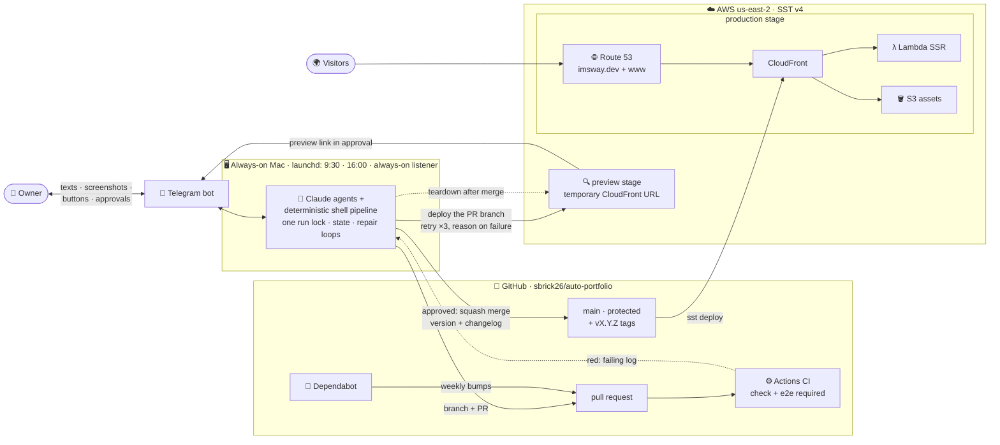
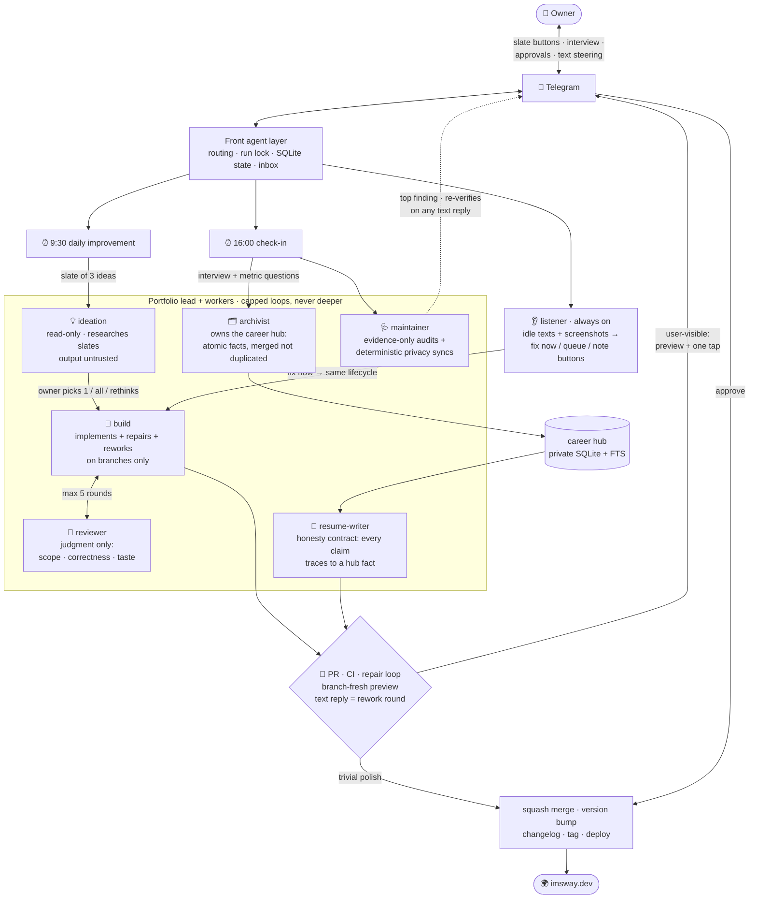
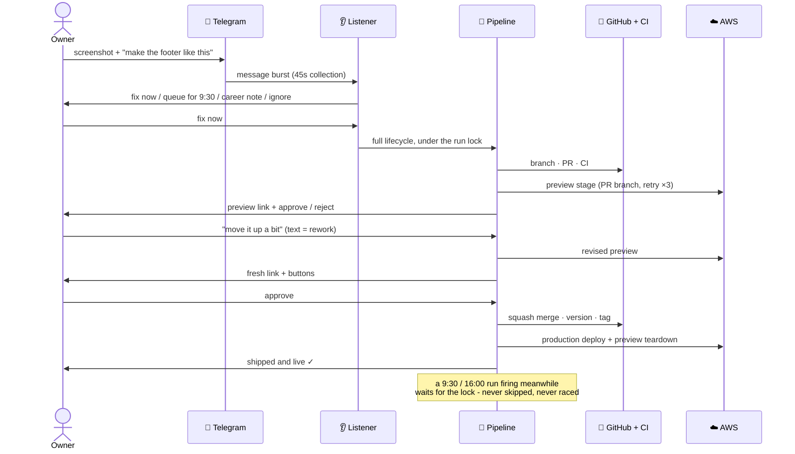

# auto-portfolio

A terminal-style portfolio site that is also a live demonstration of an autonomous,
agent-run development pipeline. The site does not just describe the system. The system
builds, tests, reviews, versions, and ships the site - on its own schedule, every day,
and on demand from the owner's phone.

Live: **[imsway.dev](https://imsway.dev)** · try the `changelog` command (and find the secret one)

**Docs:** [the agent pipeline](docs/pipeline.md) ·
[architecture and deployment](docs/architecture.md) ·
[development](docs/development.md)

## Architecture and deployment

How a change travels: agents work on the Mac, GitHub gates it, AWS serves it, and the
owner approves from a phone.



## The agents

Six workers under one project lead, three levels with a hard ceiling. Every
user-visible change ends at the same gate: a live preview link plus human approval -
and at every button prompt, a plain text reply steers the plan (rework, rethink,
re-verify) while the buttons alone decide.



## From a phone, any time

Between scheduled runs, an always-on listener owns the conversation. Texting the bot
an idea - or a screenshot of what should change - starts this:



## How it runs on its own

- **9:30** - ideation researches a slate of three improvements (owner requests queued
  from the phone take the first slots). Nothing is built until the owner picks one,
  all, or replies with direction for a rethink. Each approved idea then runs the full
  lifecycle: build, agent review, CI, branch-fresh preview, one-tap ship.
- **16:00** - the bot interviews the owner (notes texted anytime fold in from an
  inbox; open metric questions from the career hub lead the conversation), the
  archivist indexes the answers into the hub, the resume-writer refreshes the resume
  only when real achievements changed, Dependabot PRs are processed, and the
  maintainer audits the pipeline itself.
- **Any time** - the listener turns idle texts and screenshots into gated builds,
  queued ideas, or career notes - one tap decides which.
- **Collisions cannot race** - one run lock for everything. A scheduled run that fires
  mid-task waits and then executes its complete normal flow; a wedged lock raises an
  alarm instead of silent waiting.
- **Anything red retries with reasons** - preview deploys retry three times and report
  the real error; ideation retries with its raw output preserved; red CI enters the
  repair loop (conflicts reconciled semantically, capped rounds, never weakening
  tests). If Dependabot's branch is beyond repair, the pipeline re-does the bump
  itself.
- **While anything is in flight** the owner gets a heartbeat ping every minute with
  the current step; it pauses whenever the system is waiting on a human.

Full detail: [docs/pipeline.md](docs/pipeline.md).

## The career data hub

The 16:00 interview feeds a private structured index (SQLite + FTS, outside this
repo): every job, project, and achievement as an atomic fact with action, impact,
metrics, and provenance. New material merges into existing facts instead of
duplicating them, and achievements missing a number generate follow-up questions for
the owner rather than invented figures. The resume-writer works only from this hub
under a written honesty contract: no claim without a fact, numbers only direct or
transparently estimated, and client engagements always described anonymously
("a Fortune 500 trucking company"), never by name.

## Guardrails

- Agents act only on instructions from the owner (or Dependabot bumps). External PRs,
  issues, and comments are untrusted input - reported, never obeyed.
- Deterministic checks are scripts and CI, never agent judgment. Human merge is the
  final gate for anything user-visible; text replies steer, buttons decide.
- Privacy guards run in CI: a leak-scan blocks client names (auto-hardened daily from
  a private registry), no phone numbers, no private emails. Secrets live only in
  local `.env` files, never in the repo.
- Every loop is hard-capped. A maintainer fix that breaks anything pauses the pipeline.

## Quick start

```bash
npm install
npm run dev    # http://localhost:3000
npm run test   # unit + component suites
```

More in [docs/development.md](docs/development.md).
