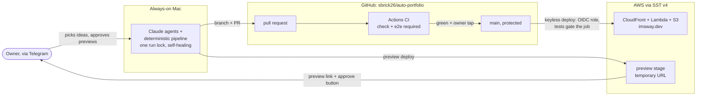

# auto-portfolio

The portfolio site at **[imsway.dev](https://imsway.dev)** - and the autonomous agent pipeline that builds, reviews, previews, and ships it. The site is an interactive skill map; the system behind it proposes improvements every weekday, builds the one the owner picks, and deploys it behind a one-tap approval from a phone.

Live: **[imsway.dev](https://imsway.dev)**

## How a change ships


```mermaid
flowchart LR
    O(["Owner, via Telegram"]) -- picks ideas, approves previews --> AG

    subgraph mac["Always-on Mac"]
        AG["Claude agents +
        deterministic pipeline
        one run lock, self-healing"]
    end

    subgraph gh["GitHub: sbrick26/auto-portfolio"]
        PR["pull request"] --> CI["Actions CI
        check + e2e required"]
        MAIN["main, protected"]
    end

    subgraph aws["AWS via SST v4"]
        PREV["preview stage
        temporary URL"]
        PROD["CloudFront + Lambda + S3
        imsway.dev"]
    end

    AG -- branch + PR --> PR
    AG -- preview deploy --> PREV
    PREV -- preview link + approve button --> O
    CI -- green + owner tap --> MAIN
    MAIN -- keyless deploy: OIDC role,
    tests gate the job --> PROD
```

No stored cloud keys anywhere: the deploy workflow proves its identity to AWS through GitHub OIDC and receives 15-minute credentials, and the deploy job runs the test suite before it can touch production.

## The short version

- **Every weekday at 9:30** an ideation agent proposes three improvements; the owner picks one (or steers with a text), a build agent implements it, a reviewer judges it, CI gates it, and a live preview link arrives with an approve button. Human merge is the final gate for anything user-visible.
- **Every day at 16:00** the bot interviews the owner, files the material into a private career hub (its own repo: [career-engine](https://github.com/sbrick26/career-engine)), refreshes the site's updates feed, and audits the pipeline itself.
- **Any time** - texting the bot an idea or a screenshot starts the same gated lifecycle on demand.
- **Privacy guards run in CI**: a leak-scan blocks client names (hardened daily from a private registry), phone numbers, and private emails. Secrets never enter the repo.

## Docs

| Doc | What it covers |
|---|---|
| [The agent pipeline](docs/pipeline.md) | The agents, the approval flows, and the phone-driven lifecycle (with diagrams) |
| [Architecture and deployment](docs/architecture.md) | Runtime topology, CI, the keyless deploy path, cost posture |
| [Development](docs/development.md) | Build/run/test, the site's stack, repo layout |

## Quick start

```bash
npm install
npm run dev    # http://localhost:3000
npm run test   # unit + component suites
```
