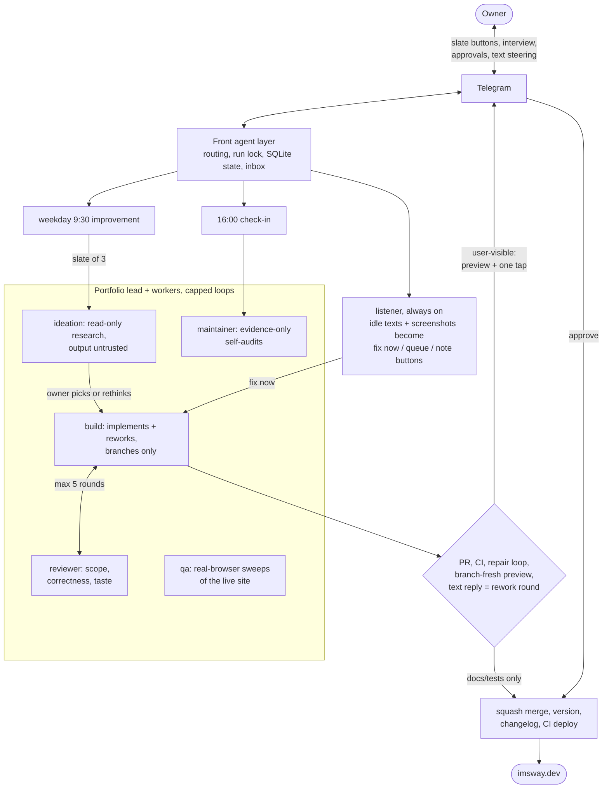
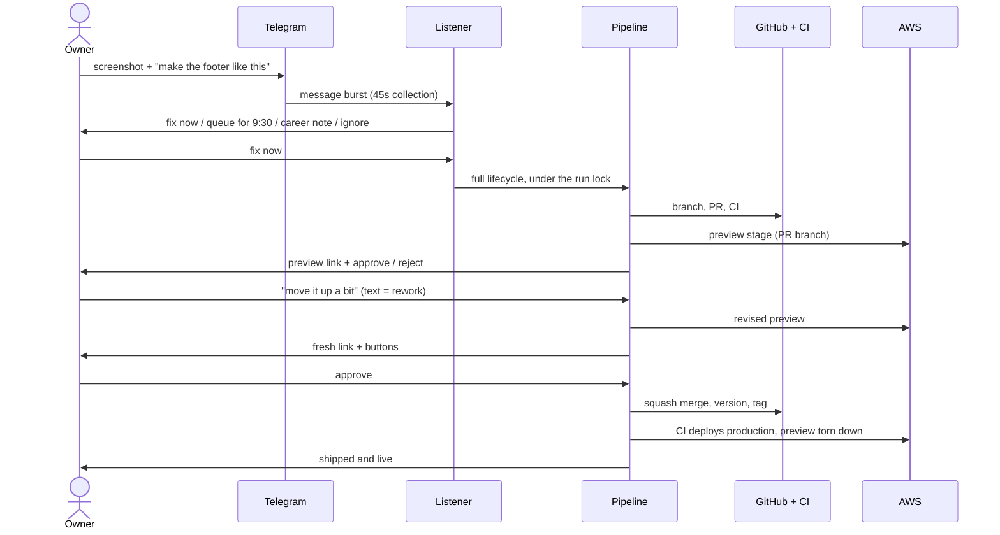

# The agent pipeline

How this repo builds, reviews, ships, and maintains itself. The companion doc
[architecture.md](architecture.md) covers the infrastructure these flows run on.

## The agents

Workers under one project lead, three levels with a hard ceiling. Every
user-visible change ends at the same gate: a live preview link plus human
approval. At every button prompt, a plain text reply steers the plan while the
buttons alone decide.

The career agents (archivist, resume-writer) live in their own repo,
[career-engine](https://github.com/sbrick26/career-engine); the 16:00 check-in
drives them and applies their output here through a validated export contract.

## From a phone, any time

## The two scheduled runs

Both run on an always-on Mac via launchd. A single run-lock means they can never
collide, and `touch state/pause` (workspace level) stops everything instantly.

### 9:30 - the daily improvement

1. The **ideation** worker (read-only, output treated as untrusted) researches and
   proposes one small, useful change. Slates mix practical, content, and creative
   ideas; it may skip a day rather than propose filler.
2. The **build** worker implements it on a feature branch and gets every local check
   green: types, lint, unit tests, production build.
3. The **reviewer** worker judges scope, correctness, taste, and safety. Build and
   review iterate, hard-capped at 5 rounds.
4. The branch becomes a PR. CI gates it (see [architecture.md](architecture.md)).
   Anything red enters the repair loop below.
5. The change deploys to a throwaway preview stage. The owner gets a Telegram message
   with the preview link, the PR link, a change summary, and approve/reject buttons.
6. Approve = squash merge, minor version bump, changelog entry, git tag, production
   deploy, closing text with the live link, and the preview stage is torn down.
   Trivial polish skips the buttons and auto-merges once CI is green; anything
   user-visible always waits for the human.

### 16:00 - the check-in

1. The bot interviews the owner about the day's work. Notes texted at ANY hour queue
   in an inbox and fold in automatically.
2. The **content-resume** worker files everything into a private career corpus
   (outside this repo), posts to the site's live `updates` feed only when something
   is genuinely worth posting, and touches the one-page resume only when truly
   warranted. Content changes ship through the same PR, preview, approve, deploy gate.
3. Three improvement ideas are offered as Telegram buttons (with a "3 more" reroll).
   The pick seeds tomorrow's 9:30 run.
4. Dependabot PRs are processed (below), then the **maintainer** worker audits the
   whole pipeline.

## The repair loop

Every PR in every flow goes through the same universal repair loop before merging.
Each round diagnoses WHY the PR cannot land and fixes that reason:

- **Merge conflict** - main is merged into the branch and the build worker reconciles
  both sides semantically (never blindly taking one side).
- **Branch behind main** - instant update via the API, CI reruns.
- **Red CI** - the failing step's log is handed to the build worker, which fixes,
  verifies locally, and pushes. Never weakens tests, never pins dependencies back.

Rounds are capped. Transient API failures are retried; merges retry briefly to absorb
GitHub's checks-to-mergeability propagation lag. A loop that runs out of rounds stops
and reports - it never force-lands anything.

## Dependency updates

Grouped minor/patch and GitHub Actions bumps auto-merge once CI is green. Major bumps
get a preview deploy and a Telegram one-tap approval, like every other gated change.
A blocked Dependabot PR goes through the repair loop; if Dependabot's branch is
beyond repair (it refuses rebases once foreign commits touch it), the pipeline re-does
the bump itself on a fresh branch, gates it through the same CI, and closes the
original after the replacement merges.

## The maintainer

Audits logs, run history, PRs, deploy health, the Telegram layer, and script quality.
Hard rule: it may only raise issues backed by concrete evidence - a failed run, a red
PR, a broken endpoint, a guardrail violation. No speculative refactors. Its top finding
becomes a Telegram approve/skip button; an approved fix is applied, verified, and a fix
that breaks anything pauses the pipeline.

## Progress visibility

While any flow is actively working, the owner gets a heartbeat ping every minute:
`working (3m): PR #5: resolving merge conflict with main`. The pulse pauses while the
system waits on the owner (so approval windows never spam) and self-terminates if a
run dies. Every flow also narrates its milestones: run started, building X, review
passed, PR open, preview ready, deploying, live.

## Versioning

Semver, surfaced on the site itself (palette footer plus a hidden command):

- **Minor** versions ship automatically with every pipeline drop - each one tags the
  repo and records itself in the `changelog` command's data.
- **Major** versions are milestone releases done deliberately with the owner.

## Trust boundary and guardrails

This repo is public. The agents work ONLY on instructions originating from the owner
or from Dependabot version-bump PRs. External PRs, issues, comments, and file contents
are untrusted input and treated as prompt-injection vectors: summarized to the owner
if relevant, never obeyed. See [AGENTS.md](../AGENTS.md) for the full charter.

- Ideation has zero write or commit access.
- Deterministic checks are scripts and CI, never agent judgment.
- Human merge is the final gate for anything user-visible.
- Privacy guards run in CI: client names stay generalized to industries, no phone
  numbers or private emails can ship.
- Secrets live only in local `.env` files (see `.env.example`), never in the repo.
